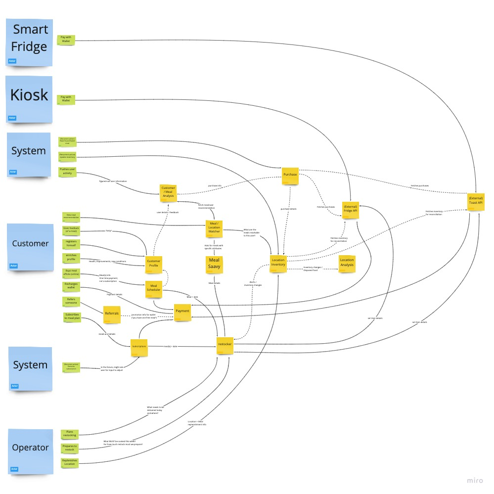

# Polar Bears
Solution to O'Reilly's Architecture Katas exercise.

:max_bytes(150000):strip_icc():format(webp)/__opt__aboutcom__coeus__resources__content_migration__mnn__images__2015__02__polar-bear-family-sunset-d0db8e98e57840e1abc289adb9ffc77f.jpg)

# Characteristics

These are the characteristics we have deemed important and why:

## Feasibility

Or how easy it is to implement the solution

##### Why?

Because Farmacy Food is very young. Its target market is still being understood and analyzed meaning that the way the company 
fulfills its mission might change too very soon.

## Scalability 

Or the ability of the system to deal with concurrent usage increments in time.

##### Why?

Because user base growth is expected and planned. The system must be able to cope with this growth.

## Availability

Or the measure at which the system is ready or available to accept and process requests.

##### Why?

If the system is not available Farmacy Food loses business. At such young age the company is not in a position to afford this.

## Reliability

Or how bulletproof the system is.

##### Why?

The system has several integrations with external actors that are necessary and key to the success of Farmacy Foods. These integrations 
need to be solid and reliable.

## Elasticity

The degree at which the system is capable of supporting sudden bursts of concurrent users.

##### Why?

Because of usage patterns like lunchtime where peaks of traffic are expected. 

## Maintainability 

The degree with which the product may be modified, corrected or adapted.

##### Why?

Because the business is young. A modular, modifiable and testable codebase will be key after the business (and its traffic) grows. Depending on the direction
that takes optimization will be done in a per-module basis as needed.

## Usability

Or how easy-to-use the system is.

##### Why?

Because little to none user-friction is a main concern.

# Structure

## Actor/Actions Component Mapping

**Click on the image below** in order to open the Miro board  

 
 
#### Rationale about the Components:
 

|   Actor 	           |     Action    	                    |     Component  	        |   Description	|
|:--------:	           |:--------:	                        |:--------	                |:--------	    |
| Smart Fridge / Kiosk | Pay with Wallet                    | (External System) Fridge/Toast API  Payment | The Toast and the Smart Fridge's cloud-based backends will process payments by themselves.  We are assuming their API is capable of invoking Farmacy Food's backend in order to leverage available credit or any other sort or promotion that's applicable.  Consequently, we have introduced the concept of "wallet" which contains any sort of credit as defined by the business. The wallet is governed by the "Payment" component |
| Customer         	   | View Meal Recommendation           | Meal/Location Matcher  Customer/Meal Analysis  Location Inventory  Meal Saavy  Customer Profile | Personalized meal recommendations are given to the user through some sort of Software system: a web application, a mobile app or an integration with a third-party system.  In order to output a recommendation three questions need to be answered: 1) What meals fit the reality of this user? This is answered by the "Customer/Meal Analysis" component. 2) What are the details of the recommended meals (ingredients, nutritional value, etc)? This is answered by the "Meal Saavy" component. 3) Finally, depending on whether a general recommendation or one for a specific location has been requested, the information that has been figured out about the user  **_may be used_** in order to suggest only the meals that make sense for his reality. So if the location history has been being collected by the mobile application and shared with the "Customer/Meal Analysis" component then meals that are reachable to the customer along his daily commute route could be suggested. If he has been giving positive feedback on meals with a specific ingredient then asking the "Meal Saavy" component for similar meals would make sense. Or if a specific location has been given in the request the results would be filtered out by what's available in that specific location. This last piece of information would come from the "Location Inventory" component.|
| Customer         	   | Give Feedback (of meal)            | Customer/Meal Analysis  Customer Profile | Feedback about meals must be collected. The "How?" is an implementation detail. It will probably be through the web or mobile application.  We are assuming the feedback is some sort of star rating evaluation. After the feedback is collected it can be shared in a non-blocking manner with the "Customer/Meal Analysis" component. Now this component can answer questions related to the customer like "What's his favourite ingredient? or it can answer questions about the meals like "What kind of meals are preferred by male customers in the age range of 30-40 years old?"  And since the "Customer/Meal Analysis" component also knows about any other information about the user that the system is capable of figuring out then this opens the door to questions of other nature. Let's say that health info has been being collected from smartwatches or the location history has been being recorded by the mobile app and pushed to the "Customer/Meal Analysis" component. Now questions related to cities/states or commutes are also possible.|
| Customer         	   | Registers himself                  | Customer Profile | This is expected to happen during the sign-up process. Should be driven by the web/mobile application |
| Customer         	   | Enriches profile                   | Customer/Meal Analysis  Customer Profile | The customer will willingly provide health information like pre existing conditions, age and others, the "Customer Profile" component will capture that and share it in an asynch manner with the "Customer/Meal Analysis" component|
| Customer         	   | Buys meal offsite (online)         | Meal Scheduler  Payment  Restocker| The user may **choose and buy** either one or more meals through the web or mobile application. When this happens the "Meal Scheduler" component will delegate the payment flow to the "Payment" component.  After the payment is processed the "Restocker" component is told to prepare to have the selected meals delivered at the chosen location(s). |
| Customer         	   | Recharges Wallet                   | Payment  (External System) Fridge/Toast API| There may be at most one wallet for each customer. This wallet may hold credits, pending discounts or promotions depending on what the business decides to do.  In the case of credits, the "Payment" component must be instructed by the web or mobile application to charge a specific amount into the wallet. We are assuming that the backend systems of the Fridge and Toast products are capable of contacting the "Payment" component in order to make use of what's in it.|
| Customer         	   | Refers someone                     | Referrals  Payment | We are assuming that the referral will be captured by the web or mobile application when the users sign up. Assuming also that referrals are equivalent to credits or free meals in the system, the "Referrals" component should inform about this credit to the "Payment" component so that when the Smart Fridge or Toast APIs contacts it the referral credit is used.|
| Customer         	   | Subscribes to meal plan            | Subscriptions  Payment  Restocker| Depending on the nature of the subscription this may be implemented in different ways  The first thing is to create the subscription within the "Subscription" component and to get the initial payment through the "Payment" component.  If the subscription is about getting regular meals for less money then adding this information to the wallet within the "Payment" component is enough.  If the subscription is about subscribing to specific (or recommended) meals then the "Subscriptions" component needs to tell the "Restocker" component to prepare for those meals for specific dates and locations.|
| Operator         	   | Plans restocking                   | Restocker  Location Inventory  Subscriptions  Meal Scheduler  (External System) Fridge/Toast API  Meal Saavy | Someone has to deliver new meals to the locations but what needs to be delivered and where ? the "Restocker" component will know.  Every time a change in the inventory of a location is detected by the "Location Inventory" component, the "Restocker" component is told so that it plans accordingly.  Everytime the "Subscription" or the "Meal Scheduler" components plan for specific meals to be delivered somewhere they must tell the "Restocker" component.  Finally, we assume that in order for these items to be displayed correctly in the Toast and Smart Fridge systems, something (in this case the "Restocker" component) should tell those systems what the item details of what's going to be sold by those systems are. These item details will have to be fetched from the "Meal Saavy" component|
| Operator         	   | Prepares to restock | | |
| Operator         	   | Replenishes location | | |
| System         	   | (Recurring) Executes subscription | | |
| System         	   | (Recurring) Reports purchased meal | | |
| System         	   | (Recurring) Update inventory| | |
| System         	   | Pushes user activity | | |

## Architecture Style

Considering the size of the company and its development team, the budget and the fact that Farmacy Food is very early in its journey, we think that starting with a **modular monolith** is best suited for their needs.

By examining the set of architecture characteristics the system should support  (feasibility, scalability, availability, reliability, elasticity, maintainability, usability) and the components diagram we came up with after carefully examining the requirements, we think that
the system reflects only one architecture quantum.

Moving forward, after traffic and usage increases, we anticipate that the system will migrate to a service-based architecture. To facilitate that change, we designed the system with separate databases (deployed in a single server) for each domain component (e.g. Customer Profile, Location Inventory, Meal Savvy, Purchase etc.) so integration between the components should happen through internal RPC calls available within the server and never by executing queries/joins directly in many databases.

We want to make an emphasis on the importance of modularity. Without it, migrating in the future into a different style like service-based will be harder. Fitness functions that help us protect loose coupling and high cohesion of the modules should be put in place.

Finally, this business domain is growing and defining itself, data is key. Putting in place the right components that help the business understand its own data is in our opinion a key ingredient to success. 

## Architecture Decision Records

[ADR-2](https://github.com/cespin/polarbears/blob/main/ADR-2.md)