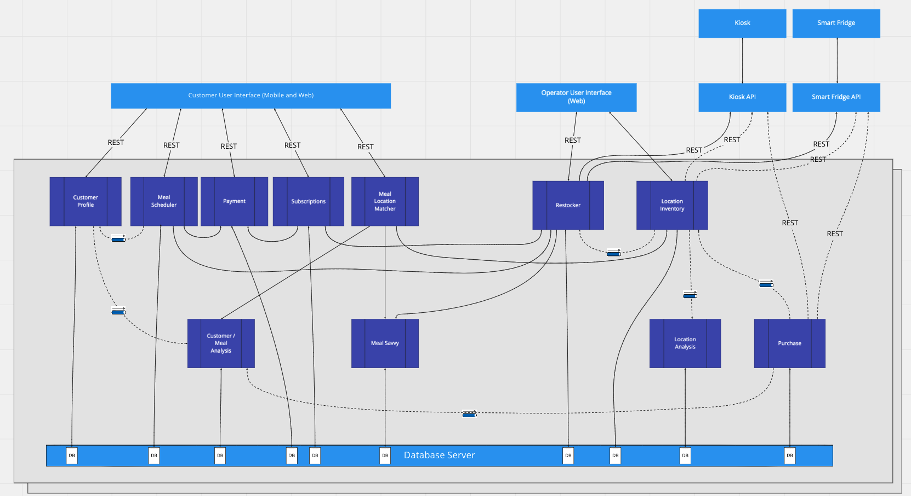

# Polar Bears
Solution to O'Reilly's Architecture Katas exercise.

:max_bytes(150000):strip_icc():format(webp)/__opt__aboutcom__coeus__resources__content_migration__mnn__images__2015__02__polar-bear-family-sunset-d0db8e98e57840e1abc289adb9ffc77f.jpg)

# Characteristics

These are the characteristics we have deemed important and why:

## Feasibility

Or how easy it is to implement the solution

##### Why?

Because Farmacy Food is very young. Its target market is still being understood and analyzed meaning that the way the company 
fulfills its mission might change too very soon.

## Scalability 

Or the ability of the system to deal with concurrent usage increments in time.

##### Why?

Because user base growth is expected and planned. The system must be able to cope with this growth.

## Availability

Or the measure at which the system is ready or available to accept and process requests.

##### Why?

If the system is not available Farmacy Food loses business. At such young age the company is not in a position to afford this.

## Reliability

Or how bulletproof the system is.

##### Why?

The system has several integrations with external actors that are necessary and key to the success of Farmacy Foods. These integrations 
need to be solid and reliable.

## Elasticity

The degree at which the system is capable of supporting sudden bursts of concurrent users.

##### Why?

Because of usage patterns like lunchtime where peaks of traffic are expected. 

## Maintainability 

The degree with which the product may be modified, corrected or adapted.

##### Why?

Because the business is young. A modular, modifiable and testable codebase will be key after the business (and its traffic) grows. Depending on the direction
that takes optimization will be done in a per-module basis as needed.

## Usability

Or how easy-to-use the system is.

##### Why?

Because little to none user-friction is a main concern.

# Architectural Style

Considering the size of the company and  the development team, the budget and the fact that Farmacy Food is very early on its journey, we think that starting with a modular monolith is best suited for their needs.

By examining the set of architecture characteristics our system should support  (feasibility, scalability, availability, reliability, elasticity, maintainability, usability) and the component diagram we came up with after carefully examining the requirements, we think that 
these architectural characteristics does not require us to separate different parts of the system into different quanta for now.

Moving forward, we anticipate the system will migrate to a service based architecture. To facilitate that change, we designed the system with separate databases in the domain components (e.g. Customer Profile, Location Inventory, Meal Savvy, Purchase etc.) so that accessing to the data will be via function/api calls instead of direct database joins/queries.

# Structure

[Please check the actor/actions analysis in this Miro shared board](https://miro.com/app/board/o9J_khJhGn0=)

|   Actor 	           |     Action    	 |     Component  	        |   Description	|
|:--------:	           |:--------:	     |:--------	                |:--------	    |
| Smart Fridge / Kiosk | Pay with Wallet                    | (External System) Fridge/Toast API  Payment | The Toast and the Smart Fridge's cloud-based backends will process payments by themselves.  We are assuming their API is capable of invoking Farmacy Food's backend in order to leverage available credit or any other sort or promotion that's applicable.  Consequently, we have introduced the concept of "wallet" which contains any sort of credit as defined by the business. The wallet is governed by the "Payment" component |
| Customer         	   | View Meal Recommendation           | Meal/Location Matcher  Customer/Meal Analysis  Location Inventory  Meal Saavy  Customer Profile | Personalized meal recommendations are given to the user through some sort of Software system: a web application, a mobile app or an integration with a third-party system.  In order to output a recommendation three questions need to be answered: 1) What meals fit the reality of this user? This is answered by the "Customer/Meal Analysis" component. 2) What are the details of the recommended meals (ingredients, nutritional value, etc)? This is answered by the "Meal Saavy" component. 3) Finally, depending on whether a general recommendation or one for a specific location has been requested, the information that has been figured out about the user  **_may be used_** in order to suggest only the meals that make sense for his reality. So if the location history has been being collected by the mobile application and shared with the "Customer/Meal Analysis" component then meals that are reachable to the customer along his daily commute route could be suggested. If he has been giving positive feedback on meals with a specific ingredient then asking the "Meal Saavy" component for similar meals would make sense. Or if a specific location has been given in the request the results would be filtered out by what's available in that specific location. This last piece of information would come from the "Location Inventory" component.|
| Customer         	   | Give Feedback (of meal)            | Customer/Meal Analysis  Customer Profile | Feedback about meals must be collected. The "How?" is an implementation detail. It will probably be through the web or mobile application.  We are assuming the feedback is some sort of star rating evaluation. After the feedback is collected it can be shared in a non-blocking manner with the "Customer/Meal Analysis" component. Now this component can answer questions related to the customer like "What's his favourite ingredient? or it can answer questions about the meals like "What kind of meals are preferred by male customers in the age range of 30-40 years old?"  And since the "Customer/Meal Analysis" component also knows about any other information about the user that the system is capable of figuring out then this opens the door to questions of other nature. Let's say that health info has been being collected from smartwatches or the location history has been being recorded by the mobile app and pushed to the "Customer/Meal Analysis". Now questions related to cities/states or commutes are also possible.|
| Customer         	   | Registers himself                  | Customer Profile | This is expected to happen during the sign-up process. Should be driven by the web/mobile application |
| Customer         	   | Enriches profile                   | | |
| Customer         	   | Buys meal offsite (online) | | |
| Customer         	   | Recharges Wallet | | |
| Customer         	   | Refers someone | | |
| Customer         	   | Subscribes to meal plan | | |
| Operator         	   | Plans restocking | | |
| Operator         	   | Prepares to restock | | |
| Operator         	   | Replenishes location | | |
| System         	   | (Recurring) Executes subscription | | |
| System         	   | (Recurring) Reports purchased meal | | |
| System         	   | (Recurring) Update inventory| | |
| System         	   | Pushes user activity | | |